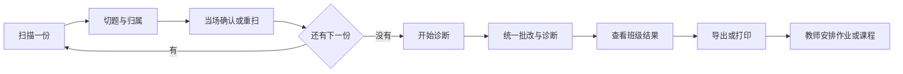

# StepBuddy 教师作业诊断系统 PRD

> **版本**：**v1.0（定稿）**
> **日期**：2026-10-02
> **状态**：已定稿，可作为开发依据
> **配套规格**：`docs/specs/` 下 4 份——01 批改与诊断、02 题型与规则、03 结果与报告、04 评测
> **MVP**：`docs/StepBuddy 教师作业诊断 MVP.md`（6 周机制验证，与完整版分开排期）
> **归档**：`docs/archive/` 下的 v1 与 v2 是**三端场景版**的迭代过程稿，已废弃，不是当前口径

## 定稿范围

本次定稿覆盖：功能范围、用户流程与交互、数据字段与依赖、异常与边界、判定机制、验收标准、阶段划分。

以下三项**确认不在本次范围**，需在后续节点补：

| 事项 | 补的时点 |
|---|---|
| 知识点体系 | 完整版开发前 |
| 教师效率基线（批改耗时对比） | 完整版开发前，需调研 |
| 评测数据来源与合规 | MVP 第 5 周前 |

定稿后新增需求一律记入待办，不在 MVP 或 P1 实施期间插入。

## 一、产品概述

面向小学数学教师的作业批改诊断工具。教师上传全班作业，系统完成批改并给出**步骤级**诊断：哪一步错、错在哪一类、为什么错。教师据此自行安排后续作业或课程。

三件事系统不做：不替教师决定布置什么作业、不生成讲评素材、不给学生或家长看结果。

产品名：小算星。

## 二、教师场景

| 项 | 内容 |
|---|---|
| 输入 | 逐份扫描的学生作业（一份一份扫），班级名单 + 题目清单 |
| 过程 | 两段。扫描段：逐份扫描 → 切题 → 归属 → 当场确认；诊断段：全部扫描完成后统一批改与诊断 → 汇总 |
| 输出 | 逐题对错、错误步骤、错误分类、班级错因统计、共性薄弱知识点 |
| 教师自行完成 | 决定布置什么作业、讲什么内容 |

**主流程**

**扫描与诊断解耦**。扫描段只做采集、切题、归属与确认，不做诊断；全部扫描完成后教师点击「开始诊断」，系统统一处理。三个好处：

1. 扫描时不用等诊断，一份没扫好可以当场重扫；
2. 诊断可以批量处理，教师不必守着屏幕；
3. 切题与归属的问题在扫描段就暴露并修掉，不会带进诊断段。

**归属在扫描段完成并确认后才计入统计**。切错一道、归错一人，诊断再准也没有意义，而教师会直接拿去讲评，错了很难发现。

**不支持一次上传多张照片**。逐份扫描虽然多花操作时间，但换来归属的确定性：教师按名单顺序扫，系统按顺序预填归属，教师只需确认或手动改。这省掉了姓名识别的不确定性。

## 三、核心目标与指标

口径标签分三档，不得跨档使用：

| 标签 | 含义 | 能否对外 |
|---|---|---|
| `AI 自评·内部口径` | 单模型标注 | 否 |
| `多模型交叉验证·内部口径` | 3 个以上独立模型交叉验证 + 金标校准 | 否，但可作为内部决策依据 |
| `教研复核·可对外` | 人类教研专家签署 | 是 |

复核方式采用**多模型交叉验证**而非人类专家（见附录 B 的 H-6）。它能提升可信度，但不等同于人类专家：多个模型可能共享认知偏差，且本质仍是「模型评模型」。因此交叉验证后标签只能到第二档，对外引用仍需人类签署。

| 口径 | 步骤级判定 | 归因 | 关系角色 | 原子步切分 | 切分准确率 | 归属准确率 |
|---|---|---|---|---|---|---|
| P0 阶段承诺 | ≥90% | ≥85% | ≥92% | ≥85% | ≥95% | ≥98% |
| 终局目标 | ≥95% | ≥90% | ≥95% | ≥90% | ≥98% | ≥99% |

切分与归属准确率定义见 `docs/specs/01-grading-and-diagnosis.md` §2.3。这两项不是辅助指标，是 P0 的退出条件——批改错了人，后面全废。

其他硬性指标：规则层一致率 100%、归因可追溯率 100%、批量批改 50 份（1000 题）在 30 秒内完成（并发 ≥11）。

## 四、架构与原则

三层结构：输入编译层（切题、归属、结构化）→ 规则层（生成解题空间）→ 诊断层（对齐、定位、归因）。中间有一层**步骤规范化**，把等价写法统一后再比对，没有它「形式等价」无从谈起。

其中**关系层建模是应用题专用且最关键的环节**：把自然语言描述转成「主体、基准量、比较量、运算关系」四个字段，这一步错了后面全错。计算类题型不经过完整的解题空间生成，走轻量判定路径（见 `01` §4.0）。

原则：**规则为核，模型为辅**。步骤对错判定、等价校验、错误分类、归因由规则引擎完成，模型只做结构化与讲解文字。模型参与的每一步都要有失败降级路径：结构化失败转人工确认，讲解失败降级为模板文案。

## 五、功能模块

九个模块。MVP 只取其中一部分，见 `docs/StepBuddy 教师作业诊断 MVP.md`。

### 5.1 班级与学生管理

| 功能 | 说明 |
|---|---|
| 班级管理 | 创建、编辑、停用班级；教师可带多个班并切换 |
| 名单导入 | 批量导入学生姓名（粘贴或文件） |
| 名单维护 | 增删改学生，处理转入转出与改名 |
| 同名区分 | 名单支持学号或编号作为辅助标识 |
| 班级规模 | 默认上限 60 人，可配置 |

### 5.2 作业管理

一次批改任务即一次作业。

| 功能 | 说明 |
|---|---|
| 新建作业 | 命名（如「第三单元练习」）、选择班级、可选关联题目清单 |
| 作业列表 | 按班级与时间查看历史作业 |
| 作业详情 | 回看该次作业的全部扫描与诊断结果 |
| 作废 | 删除一次作业及其结果 |
| 对比 | 与上次作业对比正确率变化（P1） |

### 5.3 扫描与切分

| 功能 | 说明 |
|---|---|
| 逐份扫描 | 一份一份扫，支持一份多页并关联到同一份 |
| 多题切分 | 把一份作业切成多道题，可查看与调整切题边界 |
| 归属 | 按名单顺序预填，教师确认或手动改 |
| 拍照纠偏 | 识别不确定时给出候选，择一或由教师确认 |
| 当场确认与重扫 | 扫得不好可当场重扫 |
| 扫描进度 | 显示已扫 / 未扫份数 |
| 漏扫提示 | 结束时提示未扫学生名单 |
| 跳过与补扫 | 可跳过某份，稍后补扫 |
| 已确认后重扫 | 已确认的份可删除重扫，重新归属 |
| 多页关联 | 标记「同一份的第 N 页」 |

### 5.4 诊断引擎

| 功能 | 说明 |
|---|---|
| 统一诊断 | 全部扫描完成后教师触发，系统批量批改与诊断 |
| 进度与续跑 | 显示进度；中断后从断点继续，已完成结果保留 |
| 失败重试 | 单题失败可重试，不影响其他题 |
| 重新诊断 | 修改归属或规则后重新触发，生成新记录不覆盖原结果 |
| 单题重诊断 | 单题重新诊断（P1） |

### 5.5 结果查看与改判

| 功能 | 说明 |
|---|---|
| 逐题结果 | 对错、错误步骤、错误分类、正确路径 |
| 按学生查看 | 查看某个学生本次错了哪几题 |
| 单学生详情 | 该生的完整作答与各题诊断 |
| 按题查看 | 某道题的全班作答情况 |
| 筛选 | 只看错题、按知识点筛 |
| 排序与搜索 | 按错误率排序、按姓名搜索 |
| **教师改判** | 系统判错时教师可修正结论与错误分类，改判记录留痕 |

### 5.6 班级报告

| 功能 | 说明 |
|---|---|
| 逐题正确率 | 每题的正确人数占比 |
| 知识点正确率 | 按知识点聚合 |
| 错误分类分布 | 知识性 / 行为性 / 规范性占比 |
| 共性薄弱点 | 班级正确率低于阈值的知识点 |
| 高频错误步骤 | 按错误模式聚合 |
| 学生维度 | 每人正确率与错题数（P1） |
| 未交名单 | 未扫描或未确认的学生 |
| 典型错例 | 共性错误对应的具体作答与步骤（P1） |

### 5.7 导出

| 功能 | 说明 |
|---|---|
| 导出班级报告 | 格式待定（P1） |
| 打印 | 同上 |
| 导出单学生结果 | 用于单独反馈（P1） |
| 导出典型错例 | 用于备课（P1） |

### 5.8 账号与权限

| 功能 | 说明 |
|---|---|
| 管理员开通 | 学校管理员为教师开通账号并授权到班级 |
| 登录登出 | 教师登录、登出 |
| 授权管理 | 有效期、续期、撤销 |
| 多教师同班 | 多个教师教同一班时的权限并集（P1） |

### 5.9 后台配置

| 功能 | 说明 |
|---|---|
| 题型规则 | 规则增删改与年级归属 |
| 错误模式话术 | 归因话术编辑 |
| 年级规则白名单 | 超纲判定依据 |
| 教材版本 | 配置项 |
| 知识点管理 | 知识点编码、层级与规则映射。**MVP 不涉及**，完整版开发前定义 |
| 规则启停 | 误判多的规则可临时停用 |

**不做的**：作业布置建议（需要题库，当前没有）、讲评素材生成、学生与家长端、个人长期掌握度模型、学生排名。

## 六、非功能需求

**性能**：扫描段单份处理（切题 + 归属）P95 ≤5s，教师当场可见结果；诊断段在全部扫描完成后统一执行，50 份 1000 题 30 秒内完成（并发 ≥11）；核心诊断链路单题 P95 ≤1s；解题空间生成不写死数值，由 P0 基线压测确定分档。

**成本**：单题消耗上限 2300 tokens，讲解 ≤800 tokens；周期预算待定价后按「单题上限 × 日题量 × 目标毛利」反推；缓存命中率目标 ≥40%，回归测试禁用缓存。

**合规（学校授权版）**：

| 编号 | 条款 |
|---|---|
| C-1 | 学校作为委托方签署数据处理约定，教师账号由学校管理员开通并授权到班级 |
| C-2 | 训练用途默认关闭，可配置，需学校书面同意方可开启 |
| C-3 | 学校可撤回授权，撤回后 30 日内删除已进入训练集的数据 |
| C-4 | 不收集身份证号、人脸、声纹、精确位置 |
| C-5 | 作业照片留存 ≤24 个月，批改记录 ≤36 个月，到期自动删除 |
| C-6 | 学校可请求删除指定数据，15 个工作日内完成，备份副本同步清除 |
| C-7 | 传给模型服务的内容仅限表达式与步骤文本，不含姓名、学校、班级、照片 |
| C-8 | 生成内容不进入学生正式作业记录 |

学生作业是未成年人个人信息，且教师是批量采集，合规要求不因端减少而降低。

**可维护性与灾备**：规则变更走后台配置并按批发布，发布前跑回归；进行中的批改不中途切换规则版本；数据分类备份，RPO/RTO 待部署形态确定后回填；每季度一次恢复演练。

## 七、版本规划

第五章定义了完整功能，实际交付分三个阶段。**P0 即 MVP**，范围单独定义在 `docs/StepBuddy 教师作业诊断 MVP.md`。

| 阶段 | 范围 | 退出准则 |
|---|---|---|
| P0 / MVP（约 6 周） | **只做应用题**（和差倍、归一归总），文本输入，验证建模与诊断机制。见 MVP 文档 | MVP 文档定义的三项指标：建模成功率 ≥80%、判定 ≥90%、归因 ≥85% |
| P1 / 完整版（MVP 后 3-4 个月） | 扫描与归属、班级与名单管理、作业管理、计算类五题型（轻量判定）、应用题其余族、报告与导出、改判、账号权限、多模型交叉验证 | 全部功能验收通过；交叉验证一致性达标，指标升到第二档 |
| P2 | 几何题、百分数与比、定义新运算、更细的筛选与导出形态 | — |

**MVP 与完整版是两件事**：MVP 是机制验证实验（6 周，只回答「应用题这条路走不走得通」），完整版是产品交付（含扫描、班级、全部题型与功能）。MVP 不做教师试用、性能验证与合规验证——这些属完整版。

**工作方式**：执行由模型承担，人工只做定义目标、设定验收标准、验收结果。完整功能的人工工作量约 36–42 人日（按「定义 + 验收轮次」计，见 `docs/specs/04-evaluation.md` §3.2）；MVP 是其中一部分。按周排期见 `04` §3.3，MVP 排期见 MVP 文档。

**检查点**：MVP 阶段见 `MVP 文档`（第 3 周建模规则完成、第 5 周评测集标注完成、第 6 周验收）；完整功能的检查点见 `docs/specs/04-evaluation.md` §3.3。

注意两套周次不同：MVP 是 6 周（只验证应用题），完整功能是 12 周（八类题型含扫描与班级管理）。**实际执行以 MVP 排期为准**——MVP 不通过就不进完整版。

**两条不能让步的规则**：每轮验收必须对照指标定义做真判定，不得因模型产出「看起来对」就合并轮次；同一模块连续 3 轮未通过验收，人工亲自接手实现，不再交给模型迭代。

**题型范围：MVP 只做应用题，其余全部归入完整版。**

MVP（约 6 周）只验证应用题两族——和差、和倍、差倍、归总与归一、归总，用文本输入，绕开扫描与班级管理的全部复杂度。理由是 MVP 的唯一任务是验证机制可行性：自然语言能不能转成结构化关系。引入任何额外题型或环节都是分散注意力。

完整版覆盖八类，判定分两条路径（见 `01` §4.0）：**应用题走完整机制**（关系层建模 → 解题空间 → 步骤对齐 → 溯源），**计算类走轻量判定**（解析步骤 → 精确计算校验等价 → 定位首个不等价步，不生成解题空间）。

为什么应用题是核心：计算类在数学上是确定的，规则加精确计算即可判定，做它们验证不了任何有难度的问题；应用题由自然语言描述，把「谁比谁多、单位 1 是哪个」转成结构化关系，才是需要系统机制设计的部分。若只做计算类，与「用模型加代码运算」没有本质差别。

规则规模：MVP 4–8 条（全部是应用题建模族），完整版 78–115 条（见 `02` §5）。条数少不等于工作量小——应用题规则要覆盖方向性判断的所有写法，复杂度远高于计算类规则，MVP 工期里建模规则占三分之一。

## 八、风险与限制

| 风险 | 应对 |
|---|---|
| 切分与归属不准，批改结果张冠李戴 | 归属必须人工确认后才计入统计；两项准确率列为 P0 退出条件 |
| 产能不足（一人） | 第 1 周实测校准；先收范围再延工期，不降低阈值 |
| 教师不用 | P1 投入前先验证 P0 的教师使用率；不达预期则停止后续投入 |
| 单点人员 | 全部资产文档化沉淀 |

**限制清单**：不做非计算类题型；不做其他学科；不做选择判断题批量判定；不做命题组卷；不做学生排名；不给学生或家长看结果。

## 附录 A 术语

| 术语 | 含义 |
|---|---|
| 源头错误 | 学生解题中第一个导致后续偏离的步骤，一次诊断只有一个 |
| 继承错误 | 由错误中间结果推导得出、自身逻辑成立的步骤，不重复扣分 |
| 并发次要错误 | 与源头错误无因果关系的独立错误 |
| 错误分类 | 知识性 / 行为性 / 规范性；笔误是行为性的下位类 |
| 等价等级 | 严格数值等价 / 形式等价 / 近似等价 |
| IR | 题目与学生步骤的结构化表示 |
| 原子步 | 只包含一次数学变换的步骤 |
| 退化模式 | 无法完整诊断时的次优路径，如只写答案不写过程 |
| 退出码 | 算法层终止原因标识；面向教师的行为见 `01` §5 |
| 切分 | 把一页作业切成多道题 |
| 归属 | 把切出的题归到具体学生 |
| 班级报告 | 按知识点与错误分类聚合的班级统计 |
| 规则引擎 | 承担全部核心判定的确定性组件 |
| 模型 | 承担结构化与讲解文字的组件，不参与对错判定 |
| 批改模式 | 批量批改时的快速模式，关闭讲解生成 |

## 附录 B 前提假设

| 编号 | 假设 | 不成立的影响 |
|---|---|---|
| H-1 | 识别对手写算式准确率足以支撑诊断 | 输入侧错误率过高，收紧为人工核对为主 |
| H-2 | 原子步切分准确率 ≥85% | 步骤定位基准不稳，步骤判定无从达标 |
| H-3 | 教师愿意持续使用（核心假设） | 产品没有价值，P1 停止投入 |
| H-4 | 学生会写出过程而非只写答案 | 大量题只能给对错，步骤级价值下降；观测占比超 40% 触发重议 |
| H-5 | 切分与归属准确率可达 P0 阈值 | 批改结果不可信，必须先解决输入环节 |
| H-6 | 多模型交叉验证可替代人类教研复核的**大部分**工作 | 分歧样本无人裁决时，一致性指标失去意义；对外签署仍需人类专家，否则指标只能停在第二档 |
