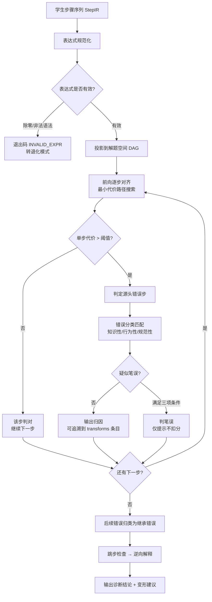

# 03 步骤对齐与错误定位算法

## 本文档解决什么问题

v1 PRD 的诊断模块有两个致命问题，四个核心问题。

**致命问题一**：4.4.1 写「从学生最后一步往前逐次校验，找到第一个不等价的步骤标记为源头错误」。从后往前扫，命中的必然是最后一步，不是源头错误。这一条与 4.4.4「仅源头错误扣分」直接冲突，「不重复扣分」在算法层无法成立。

**致命问题二**：4.3.2 明确「所有合法路径对错判定平等」，但全章没有定义怎么把学生步骤投影到解题空间 DAG 上。3.2 架构图里出现过「步骤对齐」这个词，正文再无下文。学生走「先约分后通分」而推荐路径是「先通分后约分」，两者节点不同但都合法，当前设计会判错。

**核心问题**：`变换规则标签` 由谁填没写（模型填就等于让模型归因）；「单个数字接近错误」不是可执行定义；多错误优先级与单源头错误与分项给分三者冲突；DAG 不收敛时没有出口；只写答案不写过程没有退化路径。

本文档重写诊断算法，给出代价函数、对齐规则、判定阈值、错误消解规则与全部退化出口。v1 的反向溯源表述在 §3.4 明确标注为已废弃。

## 前置依赖与文档关系

输入契约是 [01-ir-schema.md](./01-ir-schema.md) 的表达式与步骤结构，术语以 [00-glossary-and-traceability.md](./00-glossary-and-traceability.md) §2 为准。本文档的链路分段（各阶段可独立计时）是 [07-performance-and-cost.md](./07-performance-and-cost.md) §2 时延口径的来源。评测用例编号由 [04-eval-set-and-annotation.md](./04-eval-set-and-annotation.md) 引用。

---

## 1. 诊断链路总览



链路的每个环节都有对应的失败出口，出口清单见 §8。

---

## 2. 步骤对齐算法

### 2.1 定义

**步骤对齐**：把学生步骤序列投影到解题空间 DAG 上，为每一步确定其在图中的候选节点集合与最优父节点。

对齐的输入是 `StepIR[]`（含 `expr_before` / `expr_after`），输出是对齐结果数组，每项含：最佳匹配节点、匹配代价、匹配所用等价等级、候选节点列表。

### 2.2 对齐算法步骤

1. **起点锚定**：取第 1 步的 `expr_before`（缺省时取题目初始表达式），在 DAG 中定位同值节点集合。
2. **逐前推**：对第 i 步，在 DAG 中检索由上一步最佳节点出发、经一次合法变换可达、且变换结果与 `expr_after` 等价的节点集合。
3. **代价计算**：按 §3.2 的代价函数对候选节点打分，取最小者作为最佳节点，候选集合整体保留用于生成变形建议。
4. **空候选处置**：候选集合为空时进入 §8 的对齐失败出口，不得直接判错。
5. **继承标记**：某步被判为错误后，其后各步的对齐起点改用该步的 `expr_after` 实际值继续搜索，用于区分「继承错误」与「并发次要错误」。

第 5 步是 v1 完全缺失的一环。没有它就无法区分「后面跟着一起错」和「后面独立又错」，4.4.4 的优先级排序也就无从执行。

### 2.3 多路径判定规则

| 情形 | 判定 | 输出 |
|---|---|---|
| 学生步骤匹配教学推荐路径 | 判对 | 无额外输出 |
| 学生步骤匹配 DAG 内其他合法路径 | 判对 | 输出变形建议（见 00 §2.1），不扣分 |
| 学生步骤的某步与推荐路径不同，但该步变换本身合法 | 判对 | 输出变形建议指出推荐顺序 |
| 学生步骤完全落在 DAG 之外 | 判错 | 该步为源头错误，进入错误分类 |
| 学生步骤合法但超出年级白名单 | 判对 | 标注「使用高年级知识点」，不扣分 |

**关键约束**：任何情况下，只有当学生的某一步在全部合法路径下都无法匹配时，才允许判该步错误。实现时不得先选定一条推荐路径再逐步比对。

### 2.4 对齐示例

以 [01-ir-schema.md](./01-ir-schema.md) §8.1 的分数题为例（`3/4 + 1/2 * 2/3`，推荐路径为先乘后通分加）。

| 步 | 学生表达式 | 候选节点 | 代价 | 判定 |
|---|---|---|---|---|
| 1 | `1/2 * 2/3` → `2/3` | 乘法节点、约分节点 | 0.31 / 0.86 | 源头错误（0.31 > τ=0.25） |
| 2 | `3/4 + 2/3` → `9/12 + 8/12` → `17/12` | 通分加法节点 | 0.12 | 继承错误（起点已偏） |

第 2 步在 DAG 中有对应节点且变换合法，但由于其输入 `2/3` 来自错误的第 1 步，按 §2.2 第 5 步标记为继承错误，不重复扣分。这正是 v1 想要的「不重复惩罚」，但 v1 的算法给不出这个结论。

---

## 3. 前向溯源与代价函数

### 3.1 前向溯源原则

源头错误 = 学生步骤序列中**第一个**导致后续偏离的步骤。它必须从前向后确定，不能从后向前反推。v1 的反向扫描把「最后一个错误步」误当「源头错误步」，在连锁错误场景下会给出完全错误的归因。

### 3.2 代价函数

单步对齐代价由五个分量加权求和：

\[
C(s, n) = w_{str} \cdot D_{str} + w_{edit} \cdot D_{edit} + w_{eq} \cdot D_{eq} + w_{skip} \cdot D_{skip} + w_{beyond} \cdot D_{beyond}
\]

| 分量 | 含义 | 取值 | 默认权重 |
|---|---|---|---|
| `D_str` | 结构相似度差异 | 0（结构同构）到 1（完全不同） | 0.15 |
| `D_edit` | 规范化后表达式编辑距离差异 | 归一化后的字符编辑距离，除以较长串长度 | 0.35 |
| `D_eq` | 等价判定失败惩罚 | 严格数值等价失败 1.0；形式等价成功 0.1；近似等价成功 0.3（按等级取） | 0.40 |
| `D_skip` | 跳步惩罚 | 每跳过一次合法变换加 0.05，上限 0.20 | 权重并入上式 |
| `D_beyond` | 超纲惩罚 | 命中超纲元规则加 0.15 | 权重并入上式 |

**判定阈值 τ**：

| 代价区间 | 判定 | 说明 |
|---|---|---|
| `C ≤ 0.15` | 完全匹配，判对 | — |
| `0.15 < C ≤ 0.25` | 可接受变体，判对并输出变形建议 | 阈值 τ = 0.25 |
| `0.25 < C ≤ 0.40` | 可疑，需上下文裁决，不直接判错 | 触发 §5.2 provenance 复核 |
| `C > 0.40` | 判定为错误步 | 触发错误分类 |

阈值的最终取值必须由评测集校准，本文给出的是初始值与调整机制（见 04 §8）。**阈值不校准直接上线，等于把拍脑袋的数字当成诊断标准。**

### 3.3 分量计算细则

`D_eq` 的等级判定顺序：先试严格数值等价，失败后试形式等价，失败后试近似等价。**顺序不可颠倒**。若严格数值等价成功，代价直接为 0，不再计算 `D_str` 与 `D_edit`。

`D_edit` 只在规范化后计算，且分母取两串较长者长度，避免短串被过度惩罚。编辑距离作用于中缀形式，运算符与数字同等权重。

### 3.4 已废弃的表述

以下 v1 表述**不得再出现在实现与文档中**：

- 「从学生最后一步往前逐次校验」；
- 「找到第一个与标准路径不等价的步骤即源头错误」；
- 「后续步骤标注基于前序错误结果推导逻辑正确」中的「不重复扣分」若建立在反向扫描之上，一并失效。

替代方案即 §3.1 前向溯源 + §2.2 第 5 步继承标记。

---

## 4. 规范化与等价判定

### 4.1 为什么需要这一层

v1 缺少「标准解规范化」，导致「形式等价」无法落地：学生写 `2×(3+4)`、标准解写 `(3+4)×2`，两者在字符串层面完全不同。缺失这一层是「类编译器」类比在诊断环节不成立的直接原因（M-10）。

### 4.2 规范化规则

| 序 | 规则 | 输入示例 → 输出 |
|---|---|---|
| 1 | 单位书写统一 | `5 cm` → `5厘米` |
| 2 | 运算符书写统一 | `1/2 x 2/3` → `1/2 * 2/3` |
| 3 | 分数最简 | `2/4` → `1/2`（判定等价时**不要求**最简，见 §4.3 规则 4） |
| 4 | 尾随零去除 | `1.50` → `1.5` |
| 5 | 单位位置统一 | `5厘米/厘米` → 保持原形（量纲不同，不得归并，见 §4.3 规则 6） |
| 6 | 百分数展开 | `25%` → `0.25`（展示仍用原形） |
| 7 | 空白与全半角统一 | 全角 `×` → 半角 `*` |

### 4.3 等价判定规则表

| 编号 | 规则 | 判定 | 示例 |
|---|---|---|---|
| 1 | 分数交叉相乘 | `a/b ≡ c/d` iff `a×d = c×b` | `2/4 ≡ 1/2` ✓ |
| 2 | 小数与分数 | `0.5 ≡ 1/2`，但仅在题目未要求精确值时成立 | `exact=true` 时须转分数再比 |
| 3 | 尾随零 | `1.50 ≡ 1.5` | ✓ |
| 4 | 未最简分数 | 合法，仅输出变形建议，不判错 | `9/12 + 4/12 = 13/12` 判对并提示可约分 |
| 5 | 带分数与假分数 | `2 1/2 ≡ 5/2` | ✓ |
| 6 | 单位量纲 | 同量纲书写差异等价，量纲变化不等价 | `5厘米/厘米 ≢ 5` |
| 7 | 百分数 | `25% ≡ 0.25` | ✓ |
| 8 | 交换律与结合律 | `a+b ≡ b+a`，`a+b+c ≡ a+(b+c)` | 形式等价等级 |
| 9 | 逆运算 | `a+b=c` 与 `a=c-b` 互推 | 形式等价等级 |
| 10 | 近似等价容差 | 相对偏差 ≤ 题目要求精度时等价 | 保留两位小数题 `0.333` 对 `1/3` |

**容差量化**（v1 只写「误差在允许范围内」，此处补齐）：

| 场景 | 容差 |
|---|---|
| 题目要求保留 N 位小数 | 绝对偏差 ≤ `0.5 × 10^(-N)` |
| 题目要求估算（取整） | 绝对偏差 ≤ 0.5 |
| 无精度要求的精确计算 | 不启用近似等价，容差为 0 |

### 4.4 结果表达形式等价

以下差异一律**不判错**，且不扣分：整数与分数互质形式、带分数与假分数、单位前置与后置、乘号与乘号变体、百分数与小数（题目未禁止时）。

以下差异**判错**：单位缺失（若 `require_unit=true`）、结果未约分（若 `require_simplest_form=true`，判规范性错误而非计算错误）、答句缺失（判规范性错误）。

---

## 5. 规则级定位、笔误与并发判定

### 5.1 provenance 逆向推导

规则级定位的依据来自引擎逆向推导，不来自大模型标注（见 01 §5）。

1. 取该步 `expr_after` 与候选节点，枚举从父节点到该节点的合法元规则集合。
2. 取满足「能解释该步全部表达式变化」的**最小**元规则集合，写入 `transforms`。
3. 若最小集合含超纲规则，标 `status=beyond_grade`。
4. 若不存在能解释该变化的元规则集合，`transforms` 为空，错误原因只能表述为「无法用已支持规则解释该步」，**不得**由大模型补一个理由。

### 5.2 可疑区间的上下文裁决

代价落在 `(0.25, 0.40]` 时不直接判错，按以下顺序裁决：

1. 检查该步是否命中已知 OCR 易混淆特征（`ocr_corrections` 中存在候选值且 `basis=downstream_consistency`）。
2. 检查该步之后各步能否在「假设该步取候选值」的前提下全部对齐。
3. 两者均成立 → 判对，标注 OCR 修正；其一成立 → 判对并提示；均不成立 → 判错。

### 5.3 笔误判定

v1 的「单个数字接近错误」不可执行，改为三项**同时满足**：

| 条件 | 内容 |
|---|---|
| B-1 步骤类型 | 该步为誊写型步骤（`expr_before` 与上一步 `expr_after` 相同），不含关系建模 |
| B-2 差异特征 | 差异落在已知易混淆字符对内，或单字符编辑距离 ≤ 1；且数值相对偏差 ≤ 50% |
| B-3 链路自洽 | 该步之后所有步骤在「假设该步取标准值」时全部可对齐 |

附加约束：

- 仅 `source=ocr` 的步骤可判笔误。**手动输入的步骤不判笔误**——手写是学生自己写的，抄错的可能性不存在，此时应判知识性或行为性错误。
- 同一题内同类笔误出现两次及以上时，不再判笔误，升级为知识性错误。
- B-2 的数值偏差超过 50% 时直接排除笔误可能（偏差过大不符合抄错特征）。

**正例**：`26×3=78` 误写为 `26×3=88`，OCR 来源，8 与 7 属易混淆对，后续步骤用 78 可自洽 → 判笔误，仅提示。

**反例 1**：`25×4=100` 误写为 `25×4=10`，`source=manual` → 不满足笔误的来源条件，判行为性错误（计算失误）。

**反例 2**：`26×3=78` 误写为 `26×3=88`，但后续步骤用 88 继续计算且同样错误 → B-3 不成立，判行为性错误。

**反例 3**：`48+27=85` 误写为 `48+27=88`，差异为 2 个字符 → B-2 不成立，判行为性错误。

**与 OCR 择一的优先级**（本项为补充）：`01` §3.2 的 OCR 择一与本节笔误判定都用「后续链路自洽」作为判据，两者同时成立时必须分先后：

1. **先判 OCR 修正**（`01` §3.2）。若该步 `source=ocr` 且存在候选值使后续链路自洽，则判为识别修正，修正后该步判对，不属于错误；
2. **OCR 修正后仍不符**，再按本节三项判笔误；
3. 该步 `source=manual` 时跳过第 1 步，直接判笔误或行为性错误。

理由是**原因归属不同**：OCR 修正的原因在输入端（系统看错了），笔误的原因在学生端（学生写错了）。先定归属，再定判定，否则同一处差异会被两种机制重复解释。

### 5.4 知识漏洞的跨题判定

「同一学生多次同类错误判定为知识漏洞」依赖跨题历史，其计算规则见 [05-mastery-model.md](./05-mastery-model.md) §3。本文档只负责产出单题的 `knowledge_points` 与错误分类，跨题累积由掌握度模型承担。

---

## 6. 多错误与连锁消解

v1 的三处冲突（4.4.1 单源头、4.4.4 优先级、4.4.5 分项给分）在此统一。

### 6.1 三类错误

| 类型 | 定义 | 扣分处理 |
|---|---|---|
| 源头错误 | 第一个导致后续偏离的步骤 | 扣分主体 |
| 继承错误 | 由源头错误的中间结果推导得出 | 不扣分，标注「基于前序错误结果」 |
| 并发次要错误 | 与源头错误无因果关系的独立错误 | 扣分权重为源头错误的 30% |

### 6.2 消解规则

1. 一次诊断有且仅有一个源头错误，由 §3.1 前向溯源确定。
2. 错误优先级只决定**反馈展示顺序**，不决定扣分归属：知识性 > 行为性 > 规范性。
3. 多个并发次要错误按代价从大到小排序，最多展示 3 个，其余折叠。
4. 继承错误不参与优先级排序，不单独反馈。

### 6.3 与分步评分的关系

分步评分为 P2 能力，不在 P0 交付范围。启用时的归一化规则见 §7.3。

---

## 7. 特殊形态处理

### 7.1 简便运算要求

`require_simplify_calc=true` 时，非最简路径不再算合法非推荐路径，但也不判错：判对 + 输出变形建议。v1 把这条混在「路径优先级」里，导致「教学推荐路径」与「对错判定」两件事纠缠不清。

### 7.2 跳步 → 逆向解释

学生把多次变换写进一步（`split_checked=false`）时：

1. 用元规则尝试把该步补全为合法变换序列。补全成功则输出逆向解释，格式：

```
你这一步跳过了 3 次计算：
  2/3 = 4/6 = 2/3（通分）
  关键一步是通分，分母不同不能直接相加
```

2. 补全失败则按多变换步骤处理，逐个变换分别对齐，多个错误按 §6.1 分类。
3. 补全过程中若发现被省略的变换含超纲规则，标注「跳过的步骤涉及高年级内容」。

跳步不再一律「不判错仅提示」，而是转为可操作的反馈。

### 7.3 分步评分（P2 启用，P0 不交付）

v1 的 4.4.5 存在两处冲突：节点权重与列式/计算/格式占比是两种粒度；DAG 路径长度不等，节点权重无法直接归一到总分。启用时采用如下口径：

1. 权重按**题型族 × 变换类型**配置，不按 DAG 节点逐个配置。
2. 归一化按学生实际走过的路径节点数计算，不按推荐路径节点数。
3. 规范类扣分单独设上限（建议不超过总分 10%），避免格式问题淹没实质错误。
4. 小学生日常作业场景默认输出对错与状态，不输出分数；分数仅教师端开启。

---

## 8. 退化模式与失败出口

每个失败出口都必须有：退出码、用户可见话术、是否可继续诊断。三者缺一即为未完成。

本节定义的是**算法层退出码**。退出码到用户可见行为、能否继续、恢复方式的完整映射，以及批量批改的续跑语义，见 [11-interaction-flows.md](./11-interaction-flows.md) §4。接口层的错误码命名见 [09-api-contracts.md](./09-api-contracts.md) §7.1。

### 8.1 无解与超限出口

| 退出码 | 触发条件 | 用户可见话术 | 可继续 |
|---|---|---|---|
| `DAG_NO_PATH` | 生成解题空间时无法到达目标表达式 | 「这道题暂时无法给出标准解过程，请先看正确解法」 | 否，转正确解法展示 |
| `DAG_CYCLE_DETECTED` | 规则应用中出现循环依赖 | 「题目结构特殊，诊断中止」 | 否 |
| `DEPTH_EXCEEDED` | 展开深度超预算 | 「步骤较多，已按前 N 步诊断」 | 是，超出部分不诊断 |
| `COST_EXCEEDED` | 节点数超预算 | 同上，切换单路径搜索 | 是 |
| `ALIGN_FAILED` | 某步候选集合为空且退化不适用 | 「这一步没能看懂，请确认后重试」 | 否，标红该步 |

### 8.2 一题多解与验根

`target.type=set` 时走多解路径：学生结果与解集任一元素等价即判对；学生给出部分解时标注「已找到部分解，还有其余解未写出」；解方程类题目若两边同除一个可能为零的未知量，必须回代验根，验根失败归为形式等价错误。

### 8.3 只写答案不写过程

真实作业中大量学生只写结果。此时 `answer_only=true`：

1. 跳过步骤级判定，直接判最终结果对错。
2. 结果正确 → 输出「结果正确，但没有过程，无法判断推理是否规范」。
3. 结果错误 → 只给出正确结果，**不输出错误原因**（没有过程就没有可归因的推理），并提示「补充解题过程可以获得原因讲解」。
4. 该模式不产出任何错误分类，也不计入归因准确率的分母（见 04 §2.3 排除项）。

### 8.4 表达式无效

除数为 0、语法非法、变量出现在纯数值题中，判为 `INVALID_EXPR`，该步不参与等价判定，输出「这一步的算式本身写错了，请检查除数是否为零」。

### 8.5 图形题未解析

`question_type=geometry_calc` 但缺少图形解析产物时，整题进入 `GEOMETRY_NO_PARSE` 退化模式：只做文字条件下的关系校验，明确告知「图形部分未能识别，图形相关步骤未校验」。**禁止**在缺图形数据时假装完成面积体积判定。

### 8.6 其他退化模式

| 模式 | 条件 | 行为 |
|---|---|---|
| `SINGLE_EXPR_ONLY` | 学生只输入一个算式，无题干 | 直接判该算式对错，不做题意核对 |
| `UNPARSABLE_INPUT` | 结构化失败且重试 3 次仍失败 | 转手动输入，保留原图与识别结果供对照 |

---

## 9. 验收清单

- [ ] 诊断链路每个分支都有对应出口码与用户可见话术
- [ ] 前向溯源能给出唯一源头错误，反向扫描表述已从全部文档删除
- [ ] 多路径规则：合法非推荐路径一律判对，实现中不存在「先选推荐路径再比对」的逻辑
- [ ] 代价函数五个分量、权重、阈值完整，且阈值标注为待评测集校准
- [ ] 等价判定规则表覆盖 §4.3 全部 10 条，容差已量化
- [ ] 笔误三项条件与三个反例齐全，手动输入不判笔误
- [ ] 跳步输出逆向解释格式
- [ ] 退化模式覆盖只写答案、多解、无效表达式、图形未解析、单算式、结构化失败六类
- [ ] 评分相关约定标注为 P2 启用
