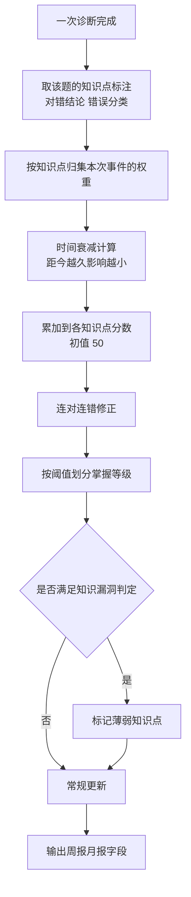

# 05 知识点掌握度模型

## 本文档解决什么问题

v1 PRD 有三处依赖掌握度，但从未定义它：

1. 4.4.4「同一学生多次同类错误判定为知识漏洞」需要跨题累积；
2. 4.6.2「按周/月生成孩子的知识点掌握报告」需要等级划分与报告字段；
3. 4.6.3「班级整体知识点掌握率、共性薄弱点」需要班级聚合。

4.5.1 又明确禁止模型做掌握度评估。也就是说这件事只能由规则引擎承担，而全文没有一句公式。这是 v1 里最典型的「引用了不存在的模块」。

本文档定义证据来源、累积与衰减规则、等级阈值、报告字段与冷启动行为。

## 前置依赖与文档关系

消费 [01-ir-schema.md](./01-ir-schema.md) §2.7 的知识点标注与 §3 的步骤判定结果；数据可见性与报告对象范围由 [06-identity-and-data-model.md](./06-identity-and-data-model.md) §3 决定；本模型的输出字段被 PRD 4.6.2、4.6.3 引用。术语以 [00-glossary-and-traceability.md](./00-glossary-and-traceability.md) §2 为准。

---

## 1. 职责边界

| 由本模型负责 | 不由本模型负责 |
|---|---|
| 知识点级分数累积、时间衰减、等级划分 | 题目难度的人工评级（由教研复核，本模型只消费） |
| 薄弱点识别与排序 | 学生能力评价与标签（不做人格化评价） |
| 周报月报的数值字段生成 | 报告的文字表述与建议措辞（由模型负责，数值由掌握度模型提供） |
| 班级聚合与共性薄弱点 | 班级排名（不做排名，避免标签化） |

---

## 2. 计算总览

---

## 3. 证据来源

**证据**仅指以下三类，全部来自规则引擎的判定结果：

| 证据字段 | 来源 | 取值 |
|---|---|---|
| 知识点 | [01](./01-ir-schema.md) §2.7 `knowledge_points` | 元规则标识构成的知识点序列 |
| 判定结论 | 步骤级判定 | 正确 / 错误 / 无法判定 |
| 错误分类 | [03](./03-alignment-and-diagnosis.md) §6.1 | 知识性 / 行为性 / 规范性 / 笔误 / 继承错误 |

**明确排除**：图片、题目文本、辅导对话、答题时长、修改次数。理由见 §1——这些数据未经验证，用作掌握度证据会让分数无法解释，也无法向家长解释。

**继承错误不作为负面证据**。学生在错误中间结果上继续推导正确，不说明知识点掌握有问题，因此不扣分也不加分。

**「无法判定」的处理**：只写答案不写过程（见 [03](./03-alignment-and-diagnosis.md) §8.3）产生的判定不进入证据，计入「数据不足」计数。

### 3.1 证据数据结构

本模型消费的是 [08-diagnosis-result-schema.md](./08-diagnosis-result-schema.md) §4.4 定义的证据对象，字段固定三项，不得扩展：

| 字段 | 类型 | 取值 |
|---|---|---|
| `knowledge_points` | array | 知识点标识列表 |
| `verdict` | enum | `correct` / `incorrect` / `partial` / `unknown` |
| `error_classification` | enum 或 null | `knowledge` / `behavioral` / `normative`；无错误时为 null |

计算式表达（对应 §4 的分数公式）：

$$s_k^{(t)} = \mathrm{clamp}\left(s_k^{(t-1)} + \sum_{e \in E_k(t)} w(\text{classification}_e) \cdot d(\text{题型族}_e) \cdot \delta(t - t_e) + c_k(t)\right)$$

其中 `w` 由 `error_classification` 查 §4.2 权重表，`d` 由题型族查 §4.3 难度权重表，`δ` 按 §4.4 衰减，`c` 按 §4.5 连对连错修正。一次作答命中多个错误分类时取绝对值最大者，不叠加。

---

## 4. 累积与衰减规则

### 4.1 分数定义

每个知识点维护一个分数 `s`，取值 `[0, 100]`，初值 50（中性：既不认为会，也不认为不会）。

$$s_{k}^{(t)} = \mathrm{clamp}\left(s_{k}^{(t-1)} + \sum_{e \in E_k(t)} w_e \cdot d_e \cdot \delta(t - t_e) + c_k(t)\right)$$

| 符号 | 含义 | 取值 |
|---|---|---|
| `E_k(t)` | 时刻 t 之前、知识点 k 相关的证据事件 | — |
| `w_e` | 错误分类权重 | 见 §4.2 |
| `d_e` | 题目难度权重 | 见 §4.3 |
| `δ(Δt)` | 时间衰减 | 见 §4.4 |
| `c_k(t)` | 连对连错修正 | 见 §4.5 |

### 4.2 错误分类权重

| 错误分类 | 权重 | 理由 |
|---|---|---|
| 知识性错误 | −1.0 | 直接说明概念或规则未掌握 |
| 行为性错误（计算失误） | −0.4 | 规则会用，执行不稳 |
| 行为性错误（笔误） | 0 | 与掌握无关（见 03 §5.3 笔误三条件） |
| 规范性错误 | −0.15 | 表达习惯问题，权重刻意压低 |
| 判定正确 | +0.6 | 正确一次的正向证据弱于错误一次，保守估计 |

一次作答中同一知识点若命中多个错误分类，取绝对值最大者，不叠加，避免多扣。

### 4.3 难度权重

| 难度档 | 权重 | 判定来源 |
|---|---|---|
| 简单 | 0.8 | 覆盖矩阵中该题型族的 G1–G3 基础形态 |
| 中等 | 1.0 | 同上，G4–G6 常规形态 |
| 困难 | 1.3 | 含多步组合、逆向推理或超纲规则的形态 |

**权重须经教研复核后固化**。当前无教研资源，先按上表取值并在报告中标注「难度权重为初始值，待教研复核」。

### 4.4 时间衰减

$$\delta(\Delta t) = \max\left(0.2,\ e^{-\Delta t / 45}\right)$$

其中 Δt 单位为天，半衰期 45 天，下限 0.2 保证一年前的证据仍有微弱影响（完全遗忘会导致长期未练的薄弱点被清零，与「精准学习」目标相悖）。

| 距今 | 衰减系数 |
|---|---|
| 0 天 | 1.00 |
| 7 天 | 0.86 |
| 30 天 | 0.51 |
| 90 天 | 0.30 |

**衰减应用于所有证据，包括正向证据**。这意味着长期不练的知识点会缓慢回落，`掌握` 等级需要持续练习维持。

### 4.5 连对连错修正

| 情况 | 修正 |
|---|---|
| 同一知识点连续 3 次正确且无任何错误 | +3（封顶 +9） |
| 同一知识点连续 3 次知识性错误 | −3（封顶 −9） |

修正项在衰减之后叠加。

---

## 5. 掌握等级与知识漏洞判定

### 5.1 等级划分

| 分数区间 | 等级 | 面向用户的表述 |
|---|---|---|
| `s < 40` | 未掌握 | 需要重新学一遍 |
| `40 ≤ s < 60` | 初步掌握 | 会做简单的，复杂的还会错 |
| `60 ≤ s < 85` | 掌握 | 基本没问题 |
| `s ≥ 85` | 精通 | 可以挑战更高难度 |

**附加条件**：证据样本数 < 5 时，等级最高只能给到「初步掌握」，并在报告中标注「数据不足」。

### 5.2 知识漏洞判定

这是 4.4.4「同一学生多次同类错误判定为知识漏洞」的可执行定义。

| 条件 | 内容 |
|---|---|
| 窗口 | 最近 10 次涉及该知识点的作答 |
| 错误次数 | 知识性错误 ≥ 3 次 |
| 集中度 | 该知识点错误占该知识点全部作答的 ≥ 60% |
| 排除 | 窗口内该知识点出现笔误 ≥ 3 次时，判定为书写习惯问题而非知识漏洞 |

四个条件同时满足才标记为知识漏洞（薄弱点）。不满足条件但分数低于 60 的，标为「待观察」。

### 5.3 薄弱点排序

按以下顺序排序，取前 5 个：

1. 是否为知识漏洞（是 > 否）
2. 分数升序
3. 错误次数降序

---

## 6. 报告字段

### 6.1 学生周报月报

| 字段 | 类型 | 说明 |
|---|---|---|
| 统计周期 | enum | 周 / 月 |
| 作答总数 | integer | 有效诊断次数，不含只写答案的退化诊断 |
| 知识点条目数 | integer | 有证据的知识点数 |
| 等级分布 | map | 四档等级各自的数量与占比 |
| 薄弱点 Top5 | array | 见 §5.3 |
| 变化趋势 | enum | 上升 / 持平 / 下降 / 数据不足 |
| 归因说明 | text | 模型依据掌握度模型数值生成的文字表述 |
| 数据充分性标注 | enum | 充分 / 样本不足 |
| 口径标注 | enum | 固定为 `AI 自评·内部口径，待教研复核` |

趋势判定：本期等级均值与上期比较，差值 ≥ 3 为上升，≤ −3 为下降，其余持平。样本不足时一律输出「数据不足」，不做趋势判断。

### 6.2 班级报告

| 字段 | 类型 | 说明 |
|---|---|---|
| 参与人数 | integer | 有有效诊断记录的学生数 |
| 知识点掌握分布 | map | 各知识点「已掌握及以上」的人数占比 |
| 共性薄弱点 | array | 班级内掌握人数占比 < 40% 的知识点，按占比升序 |
| 高频错误步骤 | array | 按错误模式聚合的 Top10 |
| 题目维度正确率 | map | 每道题的正确率 |

**不做的事**：不生成学生排名，不生成班级间对比。班级报告只回答「哪些知识点全班都有问题」，用于讲评课选题。

### 6.3 聚合方式与数据延迟

| 项 | 要求 |
|---|---|
| 计算时机 | 批改完成后触发；支持手动触发重算 |
| 计算方式 | 增量：以新产生的诊断记录为输入，更新对应学生的掌握度快照，再聚合到班级；不做全量重算 |
| 数据延迟目标 | 批改完成后 **待定** 分钟内可见（具体值待部署形态确定后回填） |
| 失败处理 | 聚合失败不影响单题结果；展示聚合状态，失败时提示重试 |
| 跨班级聚合 | 禁止（见 §6.2 与 `10` §2 的 L-5） |

教师期望「批改完就能看到统计」，因此延迟目标必须在 P1 确定，不能留空。

---

## 7. 权责声明

| 事项 | 承担方 |
|---|---|
| 分数计算、等级划分、薄弱点判定 | 规则引擎 |
| 难度权重取值 | 待教研复核固化，当前为初始值 |
| 报告数值字段 | 规则引擎 |
| 报告文字表述、学习建议措辞 | 模型（仅改写，不改数值） |
| 知识漏洞下结论 | 规则引擎 |

模型不得修改任何数值字段。报告中每个数值必须能追溯到本模型的计算式。

---

## 8. 冷启动

新学生首次使用时无任何证据，处理方式：

| 情形 | 处理 |
|---|---|
| 首次诊断 | 全部知识点无分数，报告不生成，提示「完成 3 次以上诊断后可查看掌握报告」 |
| 证据数 < 5 | 等级最高给「初步掌握」，标注「数据不足」 |
| 无诊断记录 | 报告页展示空态与引导，不显示任何等级 |

**禁止**的做法：冷启动时用年级或班级平均分给每个学生赋初值。那会让家长看到一个没有依据的数字，比不给数字更糟。

---

## 9. 验收清单

- [ ] 证据仅限三类字段，继承错误与「无法判定」不计负面证据
- [ ] 错误分类权重、难度权重、衰减系数、连对连错修正四项全部有具体数值
- [ ] 四档等级阈值明确，且有样本数 < 5 的封顶规则
- [ ] 知识漏洞四条件与书写习惯排除项成文
- [ ] 周报月报与班级报告字段齐全，班级报告不含排名
- [ ] 难度权重标注为待教研复核
- [ ] 冷启动三情形与禁止做法成文
