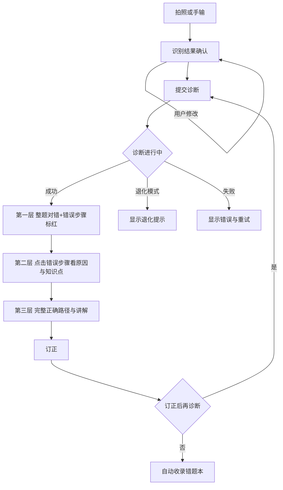

# 11 交互流程与界面状态

## 本文档解决什么问题

PRD 4.6 写了三端的功能条目，但没有任何流程：学生拍完照到看到标红之间发生什么，不知道；诊断做了一半用户退出，不知道；批改进度走到 60% 挂了，不知道；学生发现系统判错了想反馈，没有入口。全库检索「界面」，只出现在 4.5.3 的内部审核池。

`03` §8 定义了算法层的七类退出码，但那是**系统内部码**，不是用户流程。本文档补上产品层：主流程、异常分支、界面状态、反馈闭环。

## 前置依赖与文档关系

结果载荷来自 [08-diagnosis-result-schema.md](./08-diagnosis-result-schema.md)；接口与错误码见 [09-api-contracts.md](./09-api-contracts.md)；退出码语义见 [03-alignment-and-diagnosis.md](./03-alignment-and-diagnosis.md) §8.1；可见性约束来自 [06-identity-and-data-model.md](./06-identity-and-data-model.md) §3。

---

## 1. 学生端主流程

四个环节的状态必须显式定义，不得只写「成功路径」：

| 环节 | 成功 | 失败 | 用户放弃 |
|---|---|---|---|
| 拍照 | 进入识别确认 | 提示重拍，保留原图 | 返回首页，不产生记录 |
| 识别确认 | 进入诊断 | 转手输（降级 G-3） | 取消，不产生记录 |
| 诊断 | 展示三层结果 | 按 §4 分类处理 | 中途退出：结果保留并可继续查看，不重复消耗配额 |
| 订正 | 可再次诊断 | — | 直接收录错题本 |

**中途退出的处理**：诊断一旦开始，即视为已消耗配额。用户中途退出后重新进入，应看到已完成的部分结果而非重新诊断。这条语义在接口层由 [09](./09-api-contracts.md) §3.3 的流式返回与幂等键支撑。

---

## 2. 首次使用流程

| 步 | 内容 | 可跳过 | 跳过后果 |
|---|---|---|---|
| 1 | 家长创建学生档案（年级、教材版本） | 否 | 无档案无法诊断 |
| 2 | 系统生成一次性绑定码（24 小时有效、单次使用） | 是（仅学生端使用时） | 家长端无法查看该学生数据 |
| 3 | 学生输入绑定码完成绑定 | 是 | 同上 |
| 4 | 引导首次诊断（示例题或真实题） | 是 | 用户可能不会用，需在首页常驻引导入口 |
| 5 | 展示首份诊断结果与三层反馈说明 | 否 | — |

**引导首次诊断的必要性**：三层反馈是本产品的核心差异点，不做引导用户只会看第一层。第 5 步必须解释「点击错误步骤可以看到原因」，否则学生端价值减半。

教师端首次使用：创建班级 → 邀请或管理员授权 → 上传作业。`06` §4 已定义机制，界面层需补：班级为空时的引导态、授权待审批时的等待态。

---

## 3. 界面五态规范

所有列表页、详情页、报告页统一实现五态，文案与占位图由各端实现，判定逻辑统一。

| 状态 | 触发 | 展示要求 |
|---|---|---|
| 加载 | 请求进行中 | 展示骨架屏或进度；诊断场景按 [09](./09-api-contracts.md) §3.3 分段更新，不得长时间空白 |
| 空 | 无数据 | 展示空态说明与引导动作（如「还没有错题，去拍一道题」） |
| 错误 | 请求失败 | 展示错误原因 + 重试入口；原因按 [09](./09-api-contracts.md) §7 错误码映射 |
| 无权限 | 越权访问 | 展示无权限说明，不展示任何数据片段（含标题与缩略图） |
| 数据过期 | 结果基于旧规则库或旧模型版本 | 展示「本结果基于旧版本，可重新诊断」提示 |

**数据过期态**容易被忽略：规则库升级后，历史诊断结果的结论可能与新规则不一致。必须提示可重新诊断，且重新诊断视为新记录，不覆盖原结果。

---

## 4. 异常流程：退出码 → 用户行为

`03` §8.1 定义了退出码与话术，本节补产品侧的「能否继续」与「恢复方式」。

| 退出码 | 用户可见行为 | 可继续 | 恢复方式 |
|---|---|---|---|
| `DAG_NO_PATH` | 展示「暂时无法给出标准解过程，可先看正确解法」+ 正确解法 | 否 | 规则补充后自动可用 |
| `DAG_CYCLE_DETECTED` | 「题目结构特殊，诊断中止」 | 否 | 同上 |
| `DEPTH_EXCEEDED` | 「步骤较多，已按前 N 步诊断」 | 是（部分结果） | 提高预算后完整诊断 |
| `COST_EXCEEDED` | 同上 | 是（部分结果） | 同上 |
| `ALIGN_FAILED` | 标红该步 + 「这一步没能看懂，请确认」 + 手动修改入口 | 修改后可 | 用户确认或修正后重新诊断 |
| `INVALID_EXPR` | 「算式本身写错了，请检查除数是否为零」 | 否 | 用户修改后重新诊断 |
| `GEOMETRY_NO_PARSE` | 「图形部分未能识别，图形相关步骤未校验」 | 是（部分结果） | 图形能力上线后自动恢复 |
| `UNPARSABLE_INPUT` | 转手输，保留原图与识别结果对照 | 是 | 用户手输 |

**部分结果的处理原则**：任何「可继续」的异常都必须展示已完成的部分，并明确告知「未覆盖的部分未校验」，不得让用户误以为整题已诊断。

### 4.1 批量批改的续跑

| 情形 | 用户可见行为 |
|---|---|
| 批改进度中断 | 展示已完成/失败/待处理三段进度，已完成结果可查看 |
| 单题失败 | 汇总失败题数与原因，支持逐题重试或批量重试失败题 |
| 并发超限（G-6） | 展示排队状态与预计等待，不得静默等待 |
| 用户关闭页面 | 服务端继续处理，重新进入可见进度（`09` IF-4） |

---

## 5. 学生端三层反馈

PRD 4.6.1 定义了三层内容，本节补交互约束。

| 层 | 内容 | 交互约束 |
|---|---|---|
| 一 | 整题对错 + 错误步骤标红 | 首屏优先返回，不等讲解生成 |
| 二 | 点击错误步骤：错误原因、对应知识点 | 错误原因必须来自 `08` 的 `error.reason` 且 `traceable=true` |
| 三 | 完整正确路径与思路讲解 | 讲解降级为模板文案时需标注「标准讲解稍后补充」 |

**继承错误步的展示**：标为继承错误，展示「这一步的推理没问题，但因为前面算错了，跟着一起错」，不标红为错误。这个措辞直接影响家长能否理解「不重复扣分」，不能省。

---

## 6. 纠错反馈闭环

`04` §3.4 把「用户纠正反馈」列为评测集来源，但产品侧一直没有入口，闭环断裂。

| 环节 | 内容 |
|---|---|
| 入口 | 诊断结果页常驻「结果不对？」入口 |
| 反馈类型 | 判错了 / 原因说得不对 / 讲解看不懂 / 其他 |
| 载荷 | `09` IF-8：结果 ID、类型、描述、可选截图 |
| 处理 | 结果标记「已被反馈」→ 进入人工审核池（`03` §4.5.3 SLA 5 个工作日）→ 复核结论回传用户 |
| 沉淀 | 确认的错例进入难例集，用于补充错误模式与评测集 |

**必须回传复核结论**。只收反馈不回传，用户会认为提交无用，反馈率趋零，H-5 之类的假设也就无法验证。

步骤纠正（IF-10）：学生可直接修改被识别错的步骤表达式，修改后触发重新诊断，原结果标记「已被纠正」（`09` §6）。

---

## 7. 触达机制

周报月报、班级统计如何让用户知道，决定 M-6 学习效果指标能否采集。

| 内容 | 触达方式 | 阶段 |
|---|---|---|
| 单次诊断结果 | 站内即时 | P0 |
| 错题本新增 | 站内 | P0 |
| 家长周报月报 | **待定**：站内 + 推送 / 站内 + 邮件，具体待端形态确定 | P1 |
| 教师班级统计完成 | 站内 + 完成通知 | P1 |
| 反馈复核结论 | 站内 + 推送（若有） | P0 |

**触达方式当前未定，列为 P1 启动前必填项**。家长不打开报告，M-6 无从采集——这不是体验问题，是指标能否成立的问题。

---

## 8. 错题本导出打印

`06` §3 规定错题本对家长只读，本节解决导出权的归属。

| 角色 | 查看 | 增删改 | 导出打印 |
|---|---|---|---|
| 学生本人 | 是 | 是 | 是 |
| 家长 | 是 | 否（只读） | 是 |
| 教师 | 否（`06` §3） | 否 | 否 |

**判定与一致性**：导出打印是只读的延伸，不修改数据，因此允许家长导出，与 `06` §3 的「只读」不冲突。本文档为权威口径，`06` §3 需同步加注。

导出规格：格式（PDF / 图片）与打印版式（是否含手写原图）**待定**，P1 启动前确定。含手写原图会使单份文件从几十 KB 量级增至 MB 量级，且扩大隐私暴露面，需与 `06` §5 的 C-7 外发条款一并评估。

---

## 9. 其他场景

| 场景 | 处理 |
|---|---|
| 教材版本感知（G-27） | 设置项展示当前教材版本；切换后提示「将影响知识点归属，不影响计算判定」 |
| 离线与弱网（G-28） | 弱网下上传重试并展示进度；诊断结果在弱网下可查看已加载部分；**离线无法诊断**（规则引擎在服务端），需明确提示而非静默失败 |
| 多子女（G-29） | 家长端支持多子女切换，切换后数据与报告完全隔离 |
| 多班级（G-29） | 教师端支持多班级切换；多班级授权时权限取并集，但数据不跨班级聚合（避免跨班对比，L-5） |

---

## 10. 验收清单

- [ ] 主流程四环节各有成功、失败、放弃三态
- [ ] 中途退出的配额与结果保留语义成文
- [ ] 首次使用五步含可跳过性与跳过后果
- [ ] 界面五态规范含数据过期态
- [ ] 退出码到用户行为的映射表含「可继续」与「恢复方式」
- [ ] 部分结果必须明确告知未覆盖部分
- [ ] 批量批改续跑四类情形成文
- [ ] 继承错误步的展示措辞成文
- [ ] 纠错反馈闭环含回传复核结论
- [ ] 触达机制表格成文，未定项标注为 P1 启动前必填
- [ ] 导出打印的角色归属与 `06` §3 一致性已处理
- [ ] 离线场景明确「无法诊断」而非静默失败
